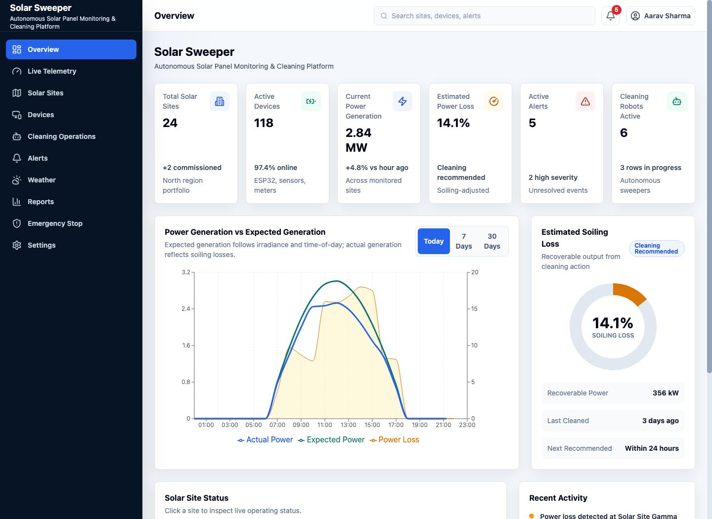
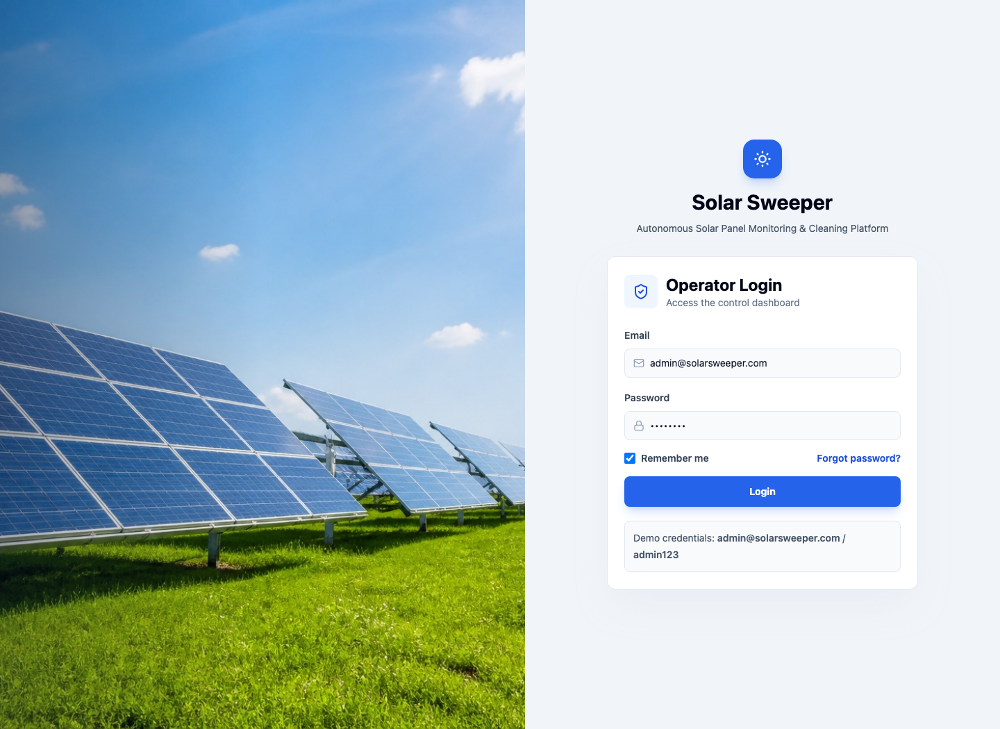
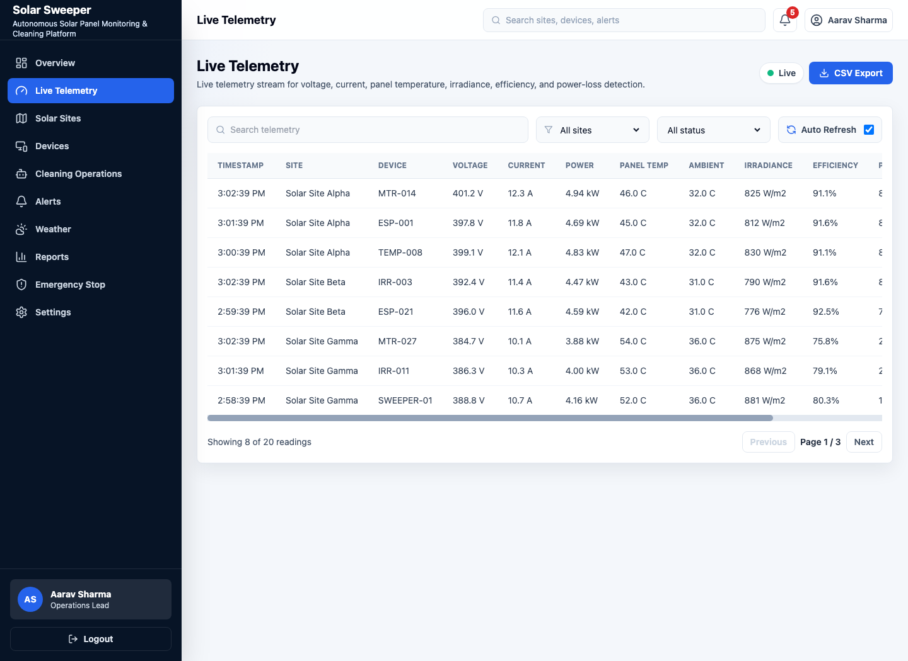
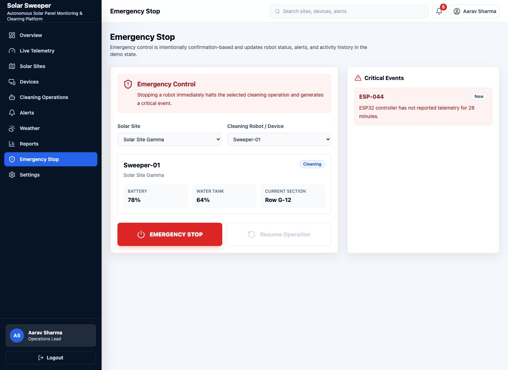

# Solar Sweeper

**Autonomous Solar Panel Monitoring & Cleaning Platform**

Solar Sweeper is a polished frontend demo for a solar-panel monitoring and autonomous cleaning capstone project. It presents a realistic industrial IoT dashboard for solar-site telemetry, power-loss and soiling analysis, autonomous cleaning robots, weather-aware recommendations, alerts, reports, and emergency controls.

The demo runs entirely in the browser with mock services, but the code is organized so it can later connect to FastAPI REST endpoints, WebSocket telemetry, MQTT data processed by the backend, PostgreSQL, and WeatherAPI.

## Live Demo

Hosted on Hugging Face Spaces:

https://huggingface.co/spaces/rohanmalhotracodes/solar-sweeper

## Screenshots

### Overview Dashboard



### Login



### Live Telemetry



### Emergency Stop



## Tech Stack

- React
- Vite
- TypeScript
- Tailwind CSS
- React Router
- Recharts
- Lucide React

## Features

- Mock authentication with persisted demo login state
- Permanent desktop sidebar with responsive mobile navigation
- KPI dashboard for sites, devices, generation, loss, alerts, and cleaning robots
- Actual vs expected generation charts with Today, 7 Days, and 30 Days controls
- Power-loss and soiling estimation using a shared calculation utility
- Live telemetry table with search, filters, pagination, CSV export, and mock WebSocket updates
- Telemetry detail drawer with last-60-minute charts for voltage, current, power, temperature, and loss
- Solar site cards and detailed site pages
- Device inventory with status, firmware, battery, signal strength, and detail drawer
- Cleaning Operations page with stateful robot controls and toast notifications
- Alerts page with acknowledge, resolve, filtering, search, and details
- Weather page structured for future WeatherAPI integration
- Emergency Stop page with confirmation modal, critical alert creation, robot state updates, and resume flow
- Reports page with energy, loss, recovery, cleaning impact charts, CSV export, and demo PDF action
- Settings page for mock dashboard, MQTT, API, WebSocket, WeatherAPI, and notification configuration

## Demo Credentials

```text
Email:    admin@solarsweeper.com
Password: admin123
```

## Quick Start

### 1. Clone the repository

```bash
git clone https://github.com/rohanmalhotracodes/Capstone.git
cd Capstone
```

### 2. Install dependencies

```bash
npm install
```

### 3. Configure environment values

The app works without a real backend. Copy the example file only when you want local environment overrides.

```bash
cp .env.example .env.local
```

Default values:

```env
VITE_API_BASE_URL=http://localhost:8000/api
VITE_WS_URL=ws://localhost:8000/ws/telemetry
VITE_WEATHER_API_KEY=
```

### 4. Run the development server

```bash
npm run dev
```

Open the local URL printed by Vite, usually:

```text
http://localhost:5173/
```

### 5. Build for production

```bash
npm run build
```

## Available Routes

| Route | Purpose |
| --- | --- |
| `/login` | Mock operator login |
| `/dashboard` | Main overview dashboard |
| `/telemetry` | Live telemetry stream, filters, export, and detail charts |
| `/sites` | Solar site portfolio |
| `/sites/:siteId` | Detailed site operations page |
| `/devices` | Device inventory and diagnostics |
| `/cleaning` | Autonomous Solar Sweeper robot operations |
| `/alerts` | Alert center with acknowledge and resolve actions |
| `/weather` | Site weather and cleaning recommendations |
| `/reports` | Energy, loss, recovery, and cleaning impact reports |
| `/emergency-stop` | Safety-critical emergency stop and resume workflow |
| `/settings` | Mock API, MQTT, WebSocket, WeatherAPI, and notification settings |

## Project Structure

```text
src/
  components/   Reusable UI building blocks
  data/         Centralized realistic mock data
  hooks/        Auth, toast, and shared solar-data state
  layouts/      Protected dashboard shell
  pages/        Routed application pages
  services/     Mock REST/WebSocket service boundaries
  types/        Shared TypeScript interfaces
  utils/        Calculations, formatting, and CSV helpers
```

Screenshot assets used by this README live in:

```text
docs/screenshots/
```

## Mock Data Architecture

Mock data is centralized rather than hardcoded inside pages:

```text
src/data/sites.ts
src/data/telemetry.ts
src/data/devices.ts
src/data/alerts.ts
src/data/robots.ts
src/data/weather.ts
src/data/generation.ts
src/data/settings.ts
```

Shared interfaces live in `src/types/`, including site, device, robot, telemetry, alert, weather, activity, and settings models.

Power loss is calculated consistently with:

```text
Power Loss % = (Expected Power - Actual Power) / Expected Power * 100
```

The utility protects against zero expected power:

```text
src/utils/calculations.ts
```

## Service Layer

The app uses mock promise-based services today:

```text
src/services/api.ts
src/services/siteService.ts
src/services/telemetryService.ts
src/services/deviceService.ts
src/services/alertService.ts
src/services/weatherService.ts
src/services/websocketService.ts
src/services/robotService.ts
```

These service boundaries are shaped for future backend routes:

```text
GET  /api/sites
GET  /api/sites/:id
GET  /api/telemetry
GET  /api/devices
GET  /api/alerts
POST /api/alerts/:id/acknowledge
POST /api/devices/:id/emergency-stop
POST /api/robots/:id/start-cleaning
GET  /api/weather/:siteId
```

## Intended Backend Architecture

The React frontend should communicate with FastAPI through REST and WebSocket endpoints. The browser should not connect directly to MQTT.

```text
Solar / Edge Devices
        ↓
Mosquitto MQTT Broker
        ↓
FastAPI MQTT Subscriber
        ↓
Processing / Validation
        ↓
PostgreSQL
        ↓
FastAPI REST + WebSocket
        ↓
React Dashboard
```

## Replacing Mocks With Real Integrations

- Replace `mockDelay` calls in `src/services/api.ts` with real `fetch` requests.
- Keep the same typed return shapes so pages do not need major rewrites.
- Replace `MockTelemetryStream` in `src/services/websocketService.ts` with `new WebSocket(import.meta.env.VITE_WS_URL)`.
- Map WeatherAPI responses into the existing `WeatherSnapshot` type in `src/services/weatherService.ts`.
- Route MQTT messages through FastAPI, not directly into React.
- Persist processed telemetry, alerts, cleaning events, and device state in PostgreSQL.

## Capstone Demo Flow

1. Log in with the demo credentials.
2. Open the overview dashboard and show portfolio KPIs.
3. Inspect the actual vs expected generation chart.
4. Open Live Telemetry and enable mock auto-refresh.
5. Show Solar Site Gamma with higher power loss and cleaning recommendation.
6. Open Cleaning Operations and start or resume a Solar Sweeper robot.
7. Watch cleaning progress, toast notifications, and activity updates.
8. Review Reports to show before/after cleaning efficiency.
9. Open Emergency Stop, select `Sweeper-01`, confirm the stop, then resume operation.

## Scripts

```bash
npm run dev      # start Vite development server
npm run build    # type-check and build production assets
npm run preview  # preview the production build locally
```

## Notes

- This is a frontend-only demo.
- No backend server is required to run the current app.
- Login, telemetry streaming, robot controls, alerts, emergency stop, reports, and settings are mocked in browser state.
- The UI is desktop-first for capstone presentation, while still supporting tablet and mobile layouts.
